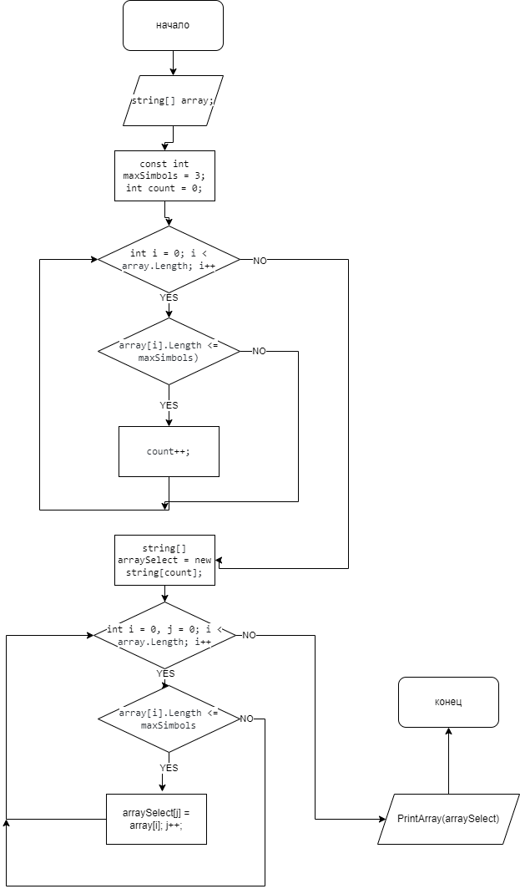

## Итоговая проверочная работа.

Программа,  из  имеющегося массива строк формирует массив 
из строк, длина которых меньше либо равна 3 символа. 

# Внизу представленна обобщеная блок схема программы.

(Блок схема)
